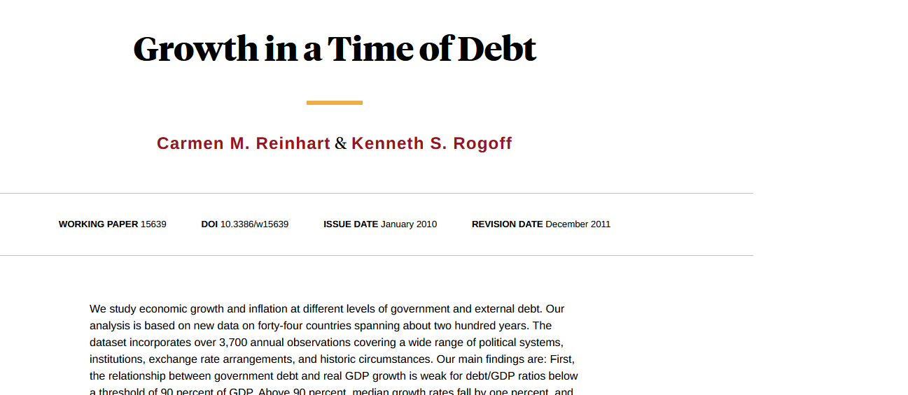
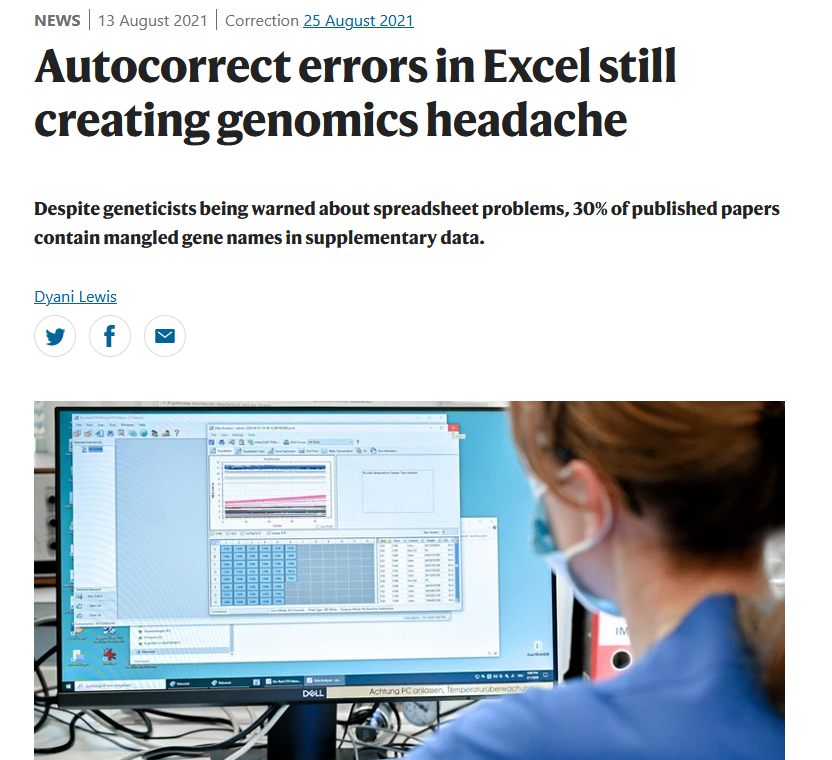

<!--_paginate: false -->
<!--_class: lead -->

# La crisis de reproducibilidad

---

# ¿Qué es la crisis de reproducibilidad?

De una encuesta a 1576 investigadores en Nature (2016):

> More than 70% of researchers have tried and failed to reproduce another scientist's experiments, and more than half have failed to reproduce their own experiments.

Baker, M., Penny, D. (2016). Is there a reproducibility crisis? *Nature*, 533, 452-454.

---

# Business as usual

**Lo tradicional:** Solo el artículo y los resultados que los autores eligen se publican.

---

# Business as usual

No datos brutos y métodos poco detallados = irreproducible

---

# Efectos no solo académicos

Errores que se propagan a la política económica mundial.

---

# Efectos no solo académicos

Un error en una hoja de Excel con tremendas consecuencias.

Si se hubiera seguido una metodología reproducible, probablemente se habría evitado.

---

# Muchos más ejemplos

Excel corrigiendo nombres de genes en miles de artículos

---

# Muchos más ejemplos

Fabricación de datos detectada gracias al requisito de publicar los datos brutos

