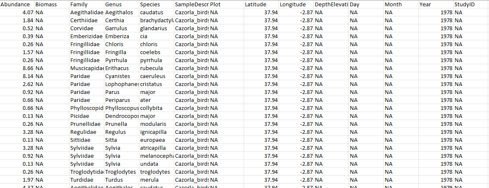

# Quiénes somos

**María Hurtado de Mendoza Romo**

-   FPI Plan Estatal, ecología (INMAR y EBD).
-   Github: https://github.com/MariaHdMR

**Sergio Picó Jorda**

-   FPI UCA, ecología (INMAR).
-   Github: https://github.com/spicjor

---

# Repositorio curso

https://github.com/spicjor/reproducible_uca23

En este repositorio podéis encontrar todos los materiales que vamos a usar durante el curso.

---

## Objetivos

1. Entender los motivos de la crisis de reproducibilidad en ciencia.
2. Conocer los fundamentos de la ciencia reproducible.
3. Aprender a usar los elementos básicos de un flujo de trabajo reproducible.
4. Aprender el uso básico del control de versión con Git y GitHub.

---

<!--_paginate: false -->

<!--_class: lead -->

# 1. La crisis de reproducibilidad

------------------------------------------------------------------------

# ¿Qué es la crisis de reproducibilidad?

De una encuesta a 1576 investigadores en Nature (2016):

> More than 70% of researchers have tried and failed to reproduce another scientist's experiments, and more than half have failed to reproduce their own experiments.

Baker, M., Penny, D. (2016). Is there a reproducibility crisis? *Nature*, 533, 452-454.

------------------------------------------------------------------------

# Business as usual

**Lo tradicional:** Solo el artículo y los resultados que los autores eligen se publican.

------------------------------------------------------------------------

# Business as usual

No datos brutos y métodos poco detallados = irreproducible

------------------------------------------------------------------------

# Efectos no solo académicos

Errores que se propagan a la política económica mundial (5000 citas en Google Scholar).

------------------------------------------------------------------------

# Efectos no solo académicos

Un error en una hoja de Excel con tremendas consecuencias.

Si se hubiera seguido una metodología reproducible, probablemente se habría evitado.

------------------------------------------------------------------------

# Muchos más ejemplos

Excel corrigiendo nombres de genes en miles de artículos

------------------------------------------------------------------------

# Muchos más ejemplos

Fabricación de datos detectada gracias al requisito de publicar los datos brutos

------------------------------------------------------------------------

<!--_paginate: false -->

<!--_class: lead -->

# 2. Ciencia reproducible

------------------------------------------------------------------------

## 2.1 Qué es la ciencia reproducible

**Reproducible (reproducibility, computational reproducibility):**

"Un estudio es reproducible si el texto del artículo viene acompañado de código... ...que permite recrear exactamente a partir de los datos originales todos los resultados y figuras incluidos en el artículo."

------------------------------------------------------------------------

**vs Repetible (replicability):**

"...replicar el mismo estudio (con nuevos datos) a partir de la información proporcionada en el artículo."

Rodríguez-Sánchez, F., Pérez-Luque, A.J. Bartomeus, I., Varela, S. 2016. Ciencia reproducible: qué, por qué, cómo. Ecosistemas 25(2): 83-92. Doi.: 10.7818/ECOS.2016.25-2.11

------------------------------------------------------------------------

## 2.2 Por qué es necesaria

1.  Garantía de transparencia y calidad. Menos errores y estos son detectables y corregibles.

2.  Poder reutilizar código ayuda a acelerar el progreso científico.

3.  Datos y código requeridos por revistas y entidades financiadoras.

4.  Beneficios personales: ahorro de tiempo y esfuerzo, facilita la colaboración, signo de calidad, más probabilidad de citas, etc.

------------------------------------------------------------------------

## 2.3 Cómo implementarla?

Necesitamos cambiar la manera en que trabajamos por un **flujo de trabajo reproducible**.

------------------------------------------------------------------------

# 3. El flujo de trabajo reproducible

## 3.1. Buenas prácticas con datos y código

---

### El principio: los datos

**Planificar:** Cómo se van a obtener, recoger, almacenar y compartir los datos.

**Recolectar:** Intentar conservar **siempre** los datos brutos en el formato original.

**Metadatos:** Descripción detallada de lo que representa cada variable, cómo se tomó, en qué unidades está, las personas encargadas, etc.

------------------------------------------------------------------------

**Control de calidad:** Plantillas o formularios ayudan a evitar errores al introducir los datos. Ser consistente en los códigos y la estructura.

**Preservación:** Asegurar que nuestros datos seguirán disponibles a largo plazo. Archivo de formato público (txt o csv por ejemplo) en un repostorio con DOI (DRYAD, Zenodo o figshare por ejemplo).Estos datos muchas veces se pueden vincular con el artículo donde se han estudiado estos datos.

---

---

### Buenas prácticas escribiendo código

---

## 3.2 Control de versión con Git

---

---

---

## 3.3 Integración con RStudio y Github

---

---

---

---

## 3.4 Redacción de artículos reproducibles

---

