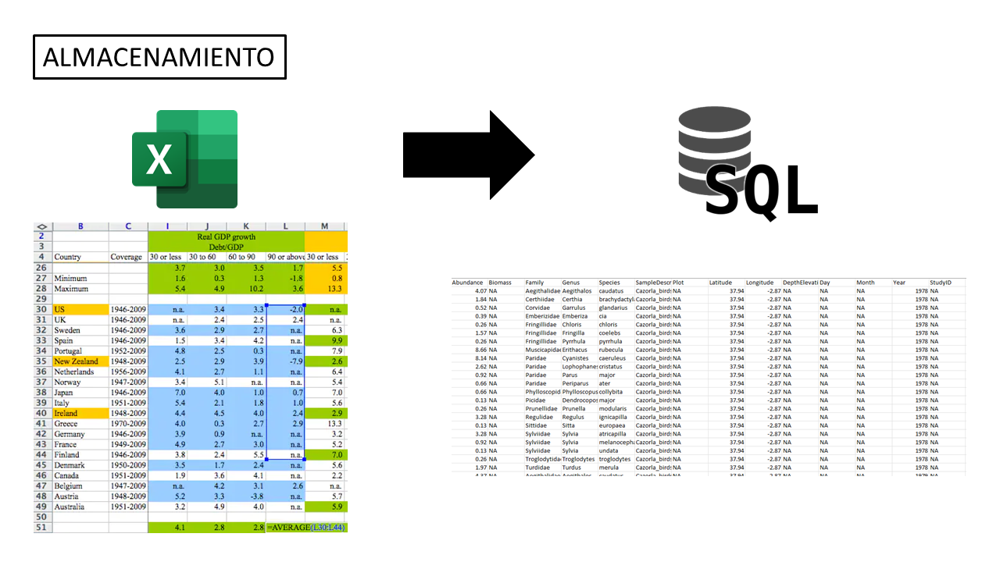
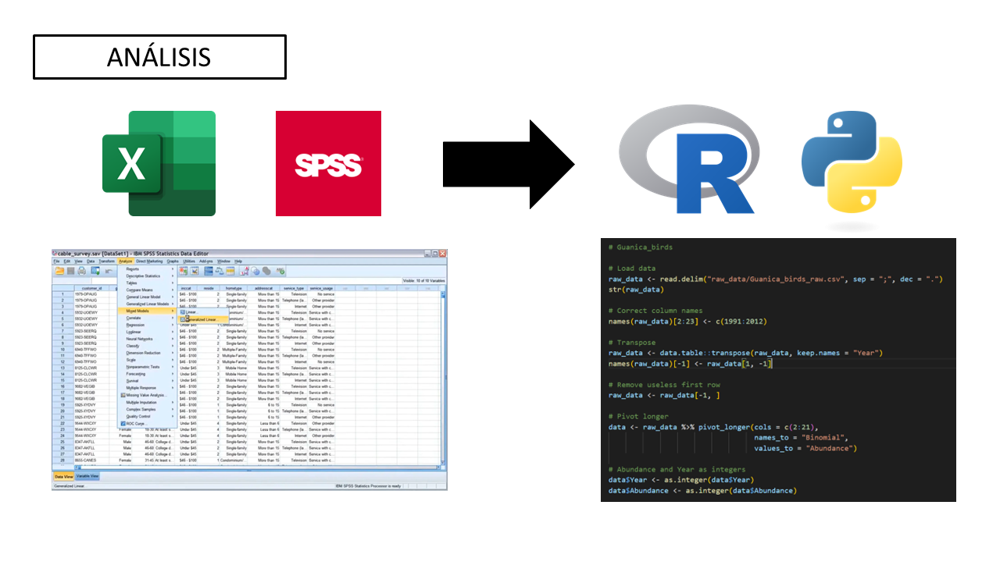
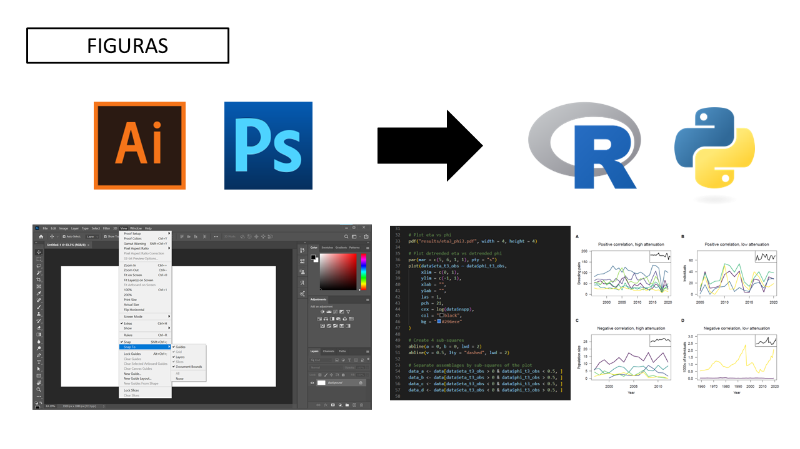
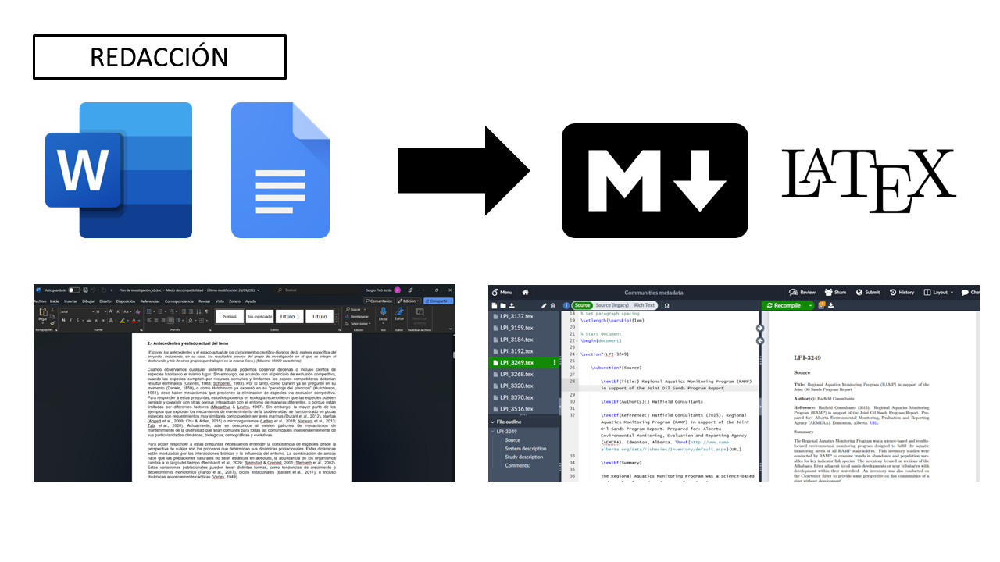

<!--_paginate: false -->
<!--_class: lead -->

# Ciencia reproducible
## ¿Qué es? ¿Cómo y por qué?

---

**Reproducible (reproducibility):**

"Un estudio es reproducible si el texto del artículo viene acompañado de código... ...que permite recrear exactamente a partir de los datos originales todos los resultados y figuras incluidos en el artículo."

**vs Repetible (replicability):**

"...replicar el mismo estudio (con nuevos datos) a partir de la información proporcionada en el artículo."

Rodríguez-Sánchez, F., Pérez-Luque, A.J. Bartomeus, I., Varela, S. 2016. Ciencia reproducible: qué, por qué, cómo. Ecosistemas 25(2): 83-92. Doi.: 10.7818/ECOS.2016.25-2.11

---

# Necesitamos cambiar el flujo de trabajo

---

---

---

---

