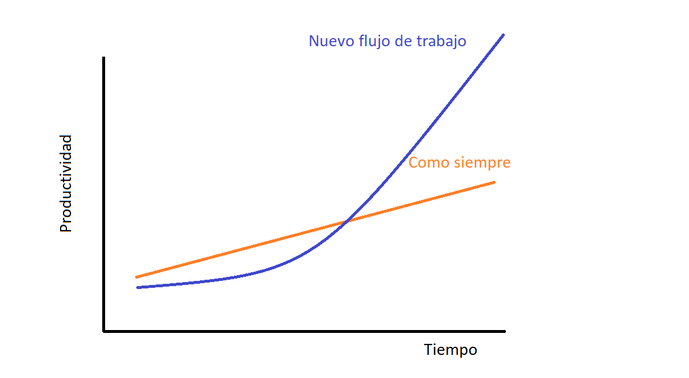

<!--_paginate: false -->
<!--_class: lead -->

# 2. Ciencia reproducible
## ¿Qué es? ¿Cómo y por qué?

---

## 2.1 Qué es la ciencia reproducible

**Reproducible (reproducibility):**

"Un estudio es reproducible si el texto del artículo viene acompañado de código... ...que permite recrear exactamente a partir de los datos originales todos los resultados y figuras incluidos en el artículo."

---

**vs Repetible (replicability):**

"...replicar el mismo estudio (con nuevos datos) a partir de la información proporcionada en el artículo."

Rodríguez-Sánchez, F., Pérez-Luque, A.J. Bartomeus, I., Varela, S. 2016. Ciencia reproducible: qué, por qué, cómo. Ecosistemas 25(2): 83-92. Doi.: 10.7818/ECOS.2016.25-2.11

---

## 2.2 Por qué es necesaria

1. Garantía de transparencia y calidad. Menos errores y estos son detectables y corregibles.

2. Poder reutilizar código ayuda a acelerar el progreso científico.

3. Datos y código requeridos por revistas y entidades financiadoras.

4. Beneficios personales: ahorro de tiempo y esfuerzo, facilita la colaboración, signo de calidad, más probabilidad de citas, etc.

---

## 2.3 Cómo implementarla?

Necesitamos cambiar la manera en que trabajamos por un **flujo de trabajo reproducible**.

