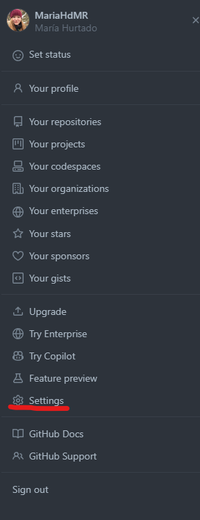
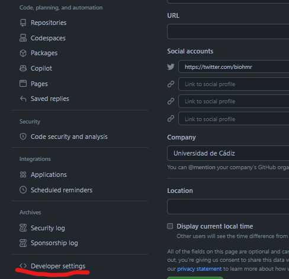
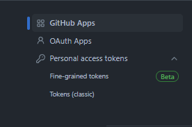
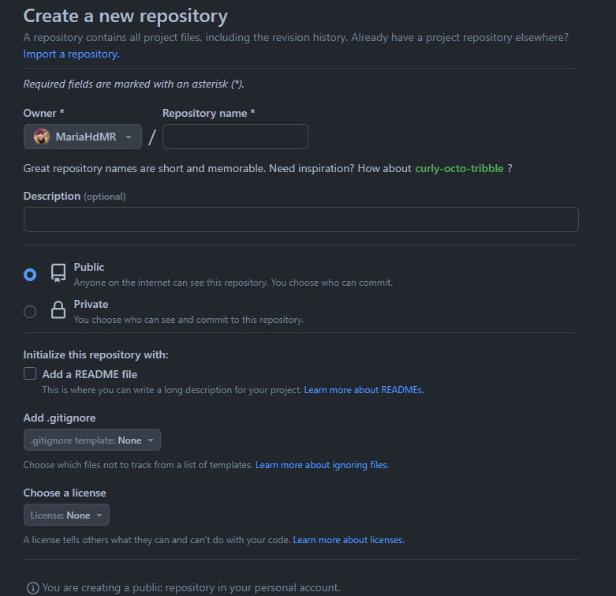
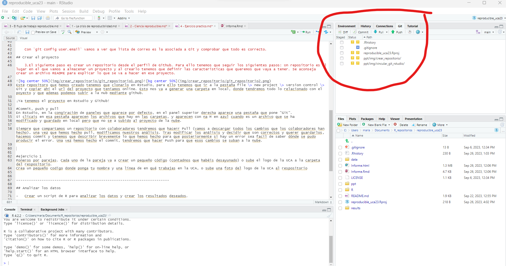

<!--_paginate: false -->

<!--_class: lead -->

# Ejercicio práctico

------------------------------------------------------------------------

## Prerequisitos

-   Instalar Git: Aquí podeis encontrar el link para descargar Git segun el sistema operativo. <https://git-scm.com/downloads>

-   Instalar R: Aqui podeis encontrar R para Windows <https://cran.r-project.org/bin/windows/base/> y aquí para Mac <https://cran.r-project.org/bin/macosx/>

-   Instalar RStudio: <https://posit.co/download/rstudio-desktop/>

------------------------------------------------------------------------

-   Crear perfil en GitHub: Lo primero de todo, vamos a tener que crearnos una cuenta en github (<https://github.com/>). CONSEJO: Crearos un nombre que ya useis en otro sitio, por ejemplo, Twitter. QUe sea un nombre de usuario sencillo, recomendable todo en minúsculas.

------------------------------------------------------------------------

-   Vincular RStudio y GitHub:

    1.  Para que las dos interfaces hablen el mismo idioma y se entiendan tenemos que crear un código personal para integrar una en otra, y esto lo hacemos creando un token. A continuación indicamos los pasos a seguir para crearlo.



------------------------------------------------------------------------



------------------------------------------------------------------------



------------------------------------------------------------------------

2.  Ahora que tenemos creado el token necesitamos ir a la terminal del ordenador nos tenemos que presentar a Git.

```{r, include = FALSE}
       git config --global user.name 'Nombre Apellido' 
       git config --global user.email '[nombreapellido\@example.com](mailto:nombreapellido@example.com){.email}' 
       git config --global --list

```

Con `git config user.email` vamos a ver que lista de correo es la asociada a Git y comprobar que todo es correcto.

------------------------------------------------------------------------

## Crear el proyecto

3.  El siguiente paso es crear un repositorio desde el perfil de Github. Para ello tenemos que seguir los siguientes pasos: Un repositorio es el lugar en el que vamos a almacenar un proyecto y al crearlo tenemos que definir las caracteristicas que queremos que vaya a tener. Se aconseja crear un archivo README para explicar lo que se va a hacer en ese proyecto.

------------------------------------------------------------------------


------------------------------------------------------------------------



------------------------------------------------------------------------

Este repositoro que hemos creado tenemos que clonarlo en Rstudio, para ello tenemos que ir a la pestaña file \> new project \> version control \> Git y copiar ahí el url del proyecto que teniamos online. Esto nos va a generar una carpeta en local, donde tendremos todo lo relacionado con el poyecto y que ademas podemos subir a la nub mediante github.

¡Ya tenemos el proyecto en Rstudio y Github!

------------------------------------------------------------------------

## Commit, push y pull

En Rstudio en la configuración de paneles que aparece por defecto, en el panel superior derecha aparece una pestaña que pone "Git". Si clicais en esa pestaña aparecen los archivos que hay en las carpetas, y aparecen con una M en azul cuando es un archivo que se ha modificado y guardado en local pero que no se ha subido al proyecto de la nube.

------------------------------------------------------------------------

Siempre que compartamos un repositorio con colaboradores tendremos que hacer Pull (vamos a descargar todos los cambios que los colaboradores han hecho), una vez que hemos hecho Pull, modificamos nuestros análisis. Tras modificar los análisis y decidir que son correctos y querer guardarlos, hacemos commit y tenemos que describir brevemente lo que hemos hecho para que posteriormente si hay un error sea fácil de saber dónde se pudo producir el error. Una vez hemos hecho el commit, tendremos que hacer Push para que esos cambios se suban a la nube.

------------------------------------------------------------------------



------------------------------------------------------------------------

Cuando hacemos commit se ven los cambios que hemos realizado, si hemos añadido algo aparece en verde, mientras que si lo hemos eliminado aparece en rojo. 


------------------------------------------------------------------------

## La he liado, ¿cómo puedo deshacer un cambio?

Cuando subo a github un cambio que no quería hacer y ya está subido, ¿cómo lo puedo resolver? Lo primero de todo es que tienes que verificar siempre que has hecho el cambio que querias hacer, pero todos nos equivocamos. Hay múltiples opciones pero aquí os vamos a mencionar 3: *restore*, *reset* y *revert*

\- **restore** se usa cuando no has llegado a hacer commit en los cambios

\- **reset/revert** cuando sí que has llegado a hacer commit.

------------------------------------------------------------------------

Explicamos las funciones mas en detalle:

\- `git restore`: deshace un `git add` y/o los cambios del directorio de trabajo.

\- `git reset`: deshace un `git commit` y/o un `git add` y/o los cambios del directorio de trabajo.

\- `git revert HEAD`: es la opción segura de `git reset` para deshacer un commit ya que no resetea un proyecto a su estado anterior eliminando todos los commits posteriores (es decir, no elimina el historial de commits). Recomendamos usar `git reset` en ramas que no hayan sido compartidas todavía (es decir, que no hayan sido commitidas a un repositorio remoto que otros estén usando). Resetear es cambiar el historial sin dejar rastro. Esto es siempre una mala práctica y puede causar problemas. Si queremos deshacer los cambios en las ramas que se comparten con otros, recomendamos utilizar el comando `git revert`. Con `git revert` quedará constancia de que se ha deshecho un cambio.

------------------------------------------------------------------------

## Ejercio 1:

Poneros por parejas. Vais a ir a la carpeta llamada Ejercicio, y tenéis que abrir el archivo que se llama informe.Rmd. Este archivo es un Rmarkdown, es un archivo donde se puede escribir texto pero también hay código. El ejercicio consite en modificar este codigo o texto, hacer un commmit explicando brevemente que habéis hecho, y hacer push. Vuestro compañero tiene que hacer pull en su ordenador, modificar otra cosa, hacer commit y push de nuevo.
