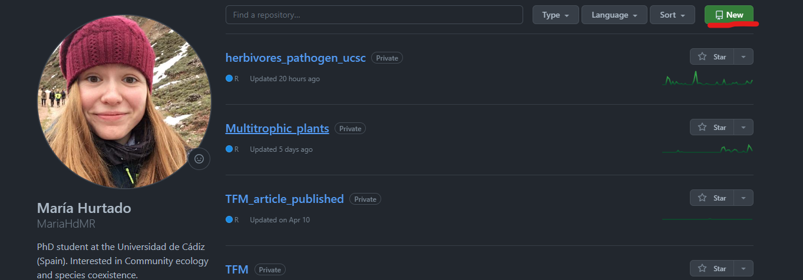

<!--_paginate: false -->

<!--_class: lead -->

# Ejercicio práctico

---

## Prerequisitos

- **Instalar Git:** https://git-scm.com/

- **Instalar R:** https://www.r-project.org/

- **Instalar RStudio:** https://posit.co/

---

- **Crear perfil en GitHub:** https://github.com

    CONSEJO: Elegir un nombre de usuario sencillo, recomendable todo minúsculas sin espacios ni caracteres especiales. Si venimos usando un mismo nombre en redes sociales u otras plataformas, es bueno usar el mismo para ser identificables.

---

- **Vincular RStudio y GitHub:**

    Necesitamos que RStudio, Git y Github se comuniquen.

    1. Creamos un token personal en GitHub.
    
        Profile -> Settings


---

- **Vincular RStudio y GitHub:**

    Developer Settings


---


---

2.  Presentarnos a Git:

```{r, include = FALSE}
       git config --global user.name 'Nombre Apellido' 
       git config --global user.email '[nombreapellido\@example.com](mailto:nombreapellido@example.com){.email}' 
       git config --global --list

```

Definimos nuestro nombre de usuario, nuestro email y comprobamos que todo es correcto.

---

## Crear un respositorio

Un repositorio es la colección de carpetas y archivos correspondiente a un proyecto. Debemos elegir:

1. Nombre. Corto pero descriptivo.
2. Público o privado.
3. README. Archivo donde explicamos en qué consiste el proyecto y describimos su contenido.
4. Licencia.

---



---


---

## Clonar el repositorio desde RStudio

File \> New Project \> Version Control \> Git

Copiar la url de nuestro repositorio de GitHub. Se genera una carpeta en local, con el contenido del repositorio.

**¡Ya tenemos nuestro proyecto sincronizado en Rstudio y Github!**

---

## Commit, push y pull

En Rstudio tenemos en el panel superior derecha una pestaña llamada "Git". Aquí nos aparecerán aquellos archivos que han sido modificados (M), y cuyos cambios no han sido aún incluidos en el control de versión.

---


---

El flujo de trabajo habitual debe ser:

1. Hacer `pull` para sincronizar nuestra versión local con la última versión de GitHub.

2. Modificamos nuestros archivos.

3. Hacemos control de versión local: `add + commit`.

4. Subimos nuestros cambios a GitHub: `push`.

---


---

## La he liado, ¿cómo vuelvo atrás?

Si he hecho un cambio que deseo eliminar, hay múltiples opciones:

- `restore`: deshace un `add` y/o los cambios del directorio de trabajo.

- `reset`: deshace un `commit` y/o un `git add` y/o los cambios del directorio de trabajo.

- `revert HEAD`: es la opción segura de `git reset` para deshacer un commit ya que no resetea un proyecto a su estado anterior eliminando todos los commits posteriores (es decir, no elimina el historial de commits). Recomendamos usar `git reset` en ramas que no hayan sido compartidas todavía (es decir, que no hayan sido commitidas a un repositorio remoto que otros estén usando). Resetear es cambiar el historial sin dejar rastro. Esto es siempre una mala práctica y puede causar problemas. Si queremos deshacer los cambios en las ramas que se comparten con otros, recomendamos utilizar el comando `git revert`. Con `git revert` quedará constancia de que se ha deshecho un cambio.

---

## ejercicio

Cada integrante del equipo independientemente:

1.  Realiza algunos cambios en el script que creaste en el ejercicio 2 o en el README.txt

2.  Realiza un commit de los cambios y prueba hacer `git reset --soft HEAD\~1`

3.  Realiza otro commit y prueba hacer `git reset --mixed HEAD\~1`

4.  Realiza un último commit y prueba hacer `git reset --hard HEAD\~1`
