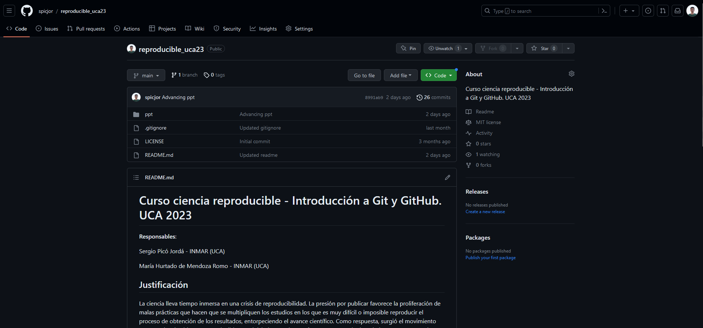
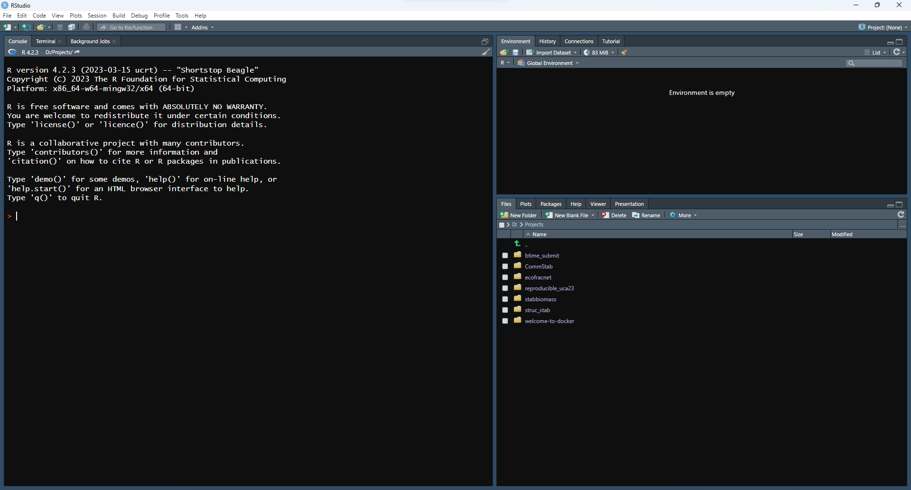

<!--_paginate: false -->
<!--_class: lead -->

# El flujo de trabajo reproducible

---

## El principio: los datos

**Planificar:** Cómo se van a obtener, recoger, almacenar y compartir los datos.

**Recolectar:** Intentar conservar **siempre** los datos brutos en el formato original.

**Metadatos:** Descripción detallada de lo que representa cada variable, cómo se tomó, en qué unidades está, las personas encargadas, etc.

---

**Control de calidad:** Plantillas o formularios ayudan a evitar errores al introducir los datos. Ser consistente en los códigos y la estructura.

**Preservación:** Asegurar que nuestros datos seguirán disponibles a largo plazo. Archivo de formato público (txt o csv por ejemplo) en un repostorio con DOI (DRYAD o figshare por ejemplo).

---

## Control de versión: Local

---

---

## Control de versión: En la nube

---

---

## Análisis en código

---

---

## Manuscritos reproducibles

---
