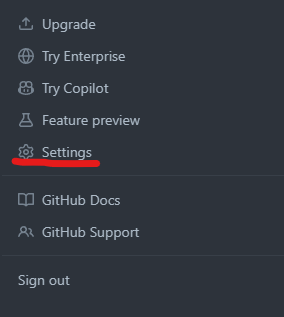
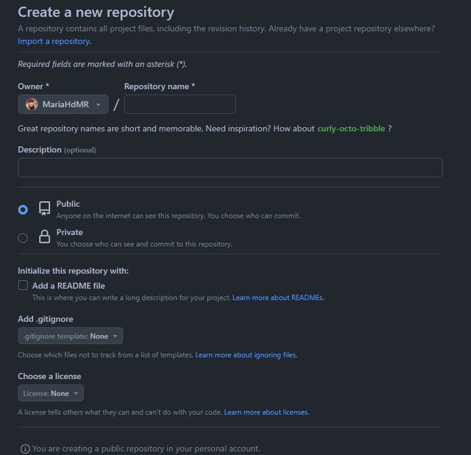

<!--_paginate: false -->

<!--_class: lead -->

# Ejercicio práctico

------------------------------------------------------------------------

## Prerequisitos

-   Instalar Git: Aquí podeis encontrar el link para descargar Git segun el sistema operativo. <https://git-scm.com/downloads>

-   Instalar R: Aqui podeis encontrar R para Windows <https://cran.r-project.org/bin/windows/base/> y aquí para Mac <https://cran.r-project.org/bin/macosx/>

-   Instalar RStudio: <https://posit.co/download/rstudio-desktop/>

-   Crear perfil en GitHub: Lo primero de todo, vamos a tener que crearnos una cuenta en github (<https://github.com/>)

-   Vincular RStudio y GitHub:

    1.  Para que las dos interfaces hablen el mismo idioma y se entiendan tenemos que crear un código personal para integrar una en otra, y esto lo hacemos creando un token. A continuación indicamos los pasos a seguir para crearlo.

      

    2.Ahora que tenemos creado el token necesitamos ir a la terminal del ordenador nos tenemos que presentar a Git.

    ```{r,include = FALSE}
       git config --global user.name 'Nombre Apellido' 
       git config --global user.email '[nombreapellido\@example.com](mailto:nombreapellido@example.com){.email}' 
       git config --global --list

    ```

    Con `git config user.email` vamos a ver que lista de correo es la asociada a Git y comprobar que todo es correcto.

## Crear el proyecto

3.El siguiente paso es crear un repositorio desde el perfil de Github. Para ello tenemos que seguir los siguientes pasos: Un repositorio es el lugar en el que vamos a almacenar un proyecto y al crearlo tenemos que definir las caracteristicas que queremos que vaya a tener. Se aconseja crear un archivo README para explicar lo que se va a hacer en ese proyecto.

 Este repositoro que hemos creado tenemos que clonarlo en Rstudio, para ello tenemos que ir a la pestaña file \> new project \> version control \> Git y copiar ahí el url del proyecto que teniamos online. Esto nos va a generar una carpeta en local, donde tendremos todo lo relacionado con el poyecto y que ademas podemos subir a la nub mediante github.

¡Ya tenemos el proyecto en Rstudio y Github!

## Commit, push y pull

En Rstudio En la configuración de paneles que aparece por defecto, en el panel superior derecha aparece una pestaña que pone "Git". Si clicais en esa pestaña aparecen los archivos que hay en las carpetas, y aparecen con na M en azul cuando es un archivo que se ha modificado y guardado en local pero que no se a subido al proyecto de la nube.

Siempre que compartamos un repositorio con colaboradores tendremos que hacerr Pull (vamos a descargar todos los cambios que los colaboradores han hecho), una vez que hemos hecho pull, modificamos nuestros análisis. Tras modificar los análisis y decidir que son correctos y querer guardarlos, hacemos commit y tenemos que describir brevemente lo que hemos hecho para que posteriormente si hay un error sea facil de saber dónde se pudo producir el error. Una vez hemos hecho el commit, tendremos que hacer Push para que esos cambios se suban a la nube.


## Ejercio 1:

Poneros por parejas. Vais a abrir el script de datos donde se analizan las variaciones de reptieles en un trasecto de Doñana. Modificad el código, haced commit, y push. La otra persona de la pareja tiene que descargarse el script que ha sido moficado y ser capaz de localizar los cambios realizados.

------------------------------------------------------------------------

## Ejercicio 2: Analizar los datos

Vamos a crear un scriot en R para analizar los datos y crear unos resultados deseado. Para ello vamos a usar la base de datos de Long-term monitoring of lizards and geckos in Doñana 2005-2021(<https://ipt.gbif.es/resource?r=reptdon2005-2021>), en la que recogen datos de reptiles a lo largo de los años en un mismo transecto en Doñana. El objetivo del codigo es sacar un mapa de las observaciones, y sacar gráficos de las series temporales de observaciones por especie y año.

------------------------------------------------------------------------

## Integrar con markdown

El código puede estar aislado en un Script o ese código se puede integrar en un markdown, que es un archivo de texto donde se puede introducir partes de código que te generan un ouput directo. Por ejemplo, escribes en el codigo una función para producir un gráfico, pues en el markdown en el ouput unicamente aparece en grafico que se quería ver.

------------------------------------------------------------------------

### Colaboración markdown

Github no solo sirve para compartir códigos, si no que se pueden compartir textos también. De esta manera, se vuelve una interfaz cómoda en la que escribir los articulos científicos y poderla compartir con los colaboradores.

## Ejercicio 3:

Con las mismas parejas creadas antes, vamos a generar un pequeño cambio en el texto, vamos a ahcer commit del cambio, y pull y lo vamos a compartir con la otra persona de la pareja. La otra persona tendra que hacer pull para ver los cambios realizados y modificar alguna otra parte para volver a generar un commit.
