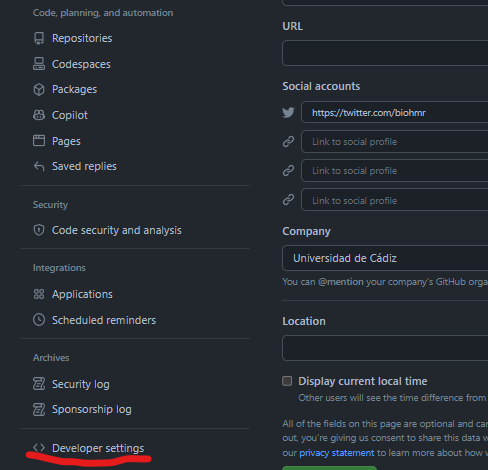

<!--_paginate: false -->

<!--_class: lead -->

# Ejercicio práctico

------------------------------------------------------------------------

## Prerequisitos

-   Instalar Git: Aquí podeis encontrar el link para descargar Git segun el sistema operativo. <https://git-scm.com/downloads>

-   Instalar R: Aqui podeis encontrar R para Windows <https://cran.r-project.org/bin/windows/base/> y aquí para Mac <https://cran.r-project.org/bin/macosx/>

-   Instalar RStudio: <https://posit.co/download/rstudio-desktop/>

-   Crear perfil en GitHub: Lo primero de todo, vamos a tener que crearnos una cuenta en github (<https://github.com/>)

-   Vincular RStudio y GitHub:

    1.  Para que las dos interfaces hablen el mismo idioma y se entiendan tenemos que crear un código personal para integrar una en otra, y esto lo hacemos creando un token. A continuación indicamos los pasos a seguir para crearlo.

      
    2.

------------------------------------------------------------------------

## Crear el proyecto

-   Crear un repositorio en GitHub
-   Clonar el proyecto desde RStudio

------------------------------------------------------------------------

## Analizar los datos

-   Crear un script de R para analizar los datos y crear los resultados deseados.

    -   Datos: Long-term monitoring of lizards and geckos in Doñana 2005-2021(<https://ipt.gbif.es/resource?r=reptdon2005-2021>).

    -   Objetivos: mapa de las observaciones, gráfico de las series temporales de observaciones por especie y año.

------------------------------------------------------------------------

## Integrar con markdown

------------------------------------------------------------------------

### Colaboración

-   Clonar el proyecto de un compañero
-   Hacer un cambio, commit y push.
